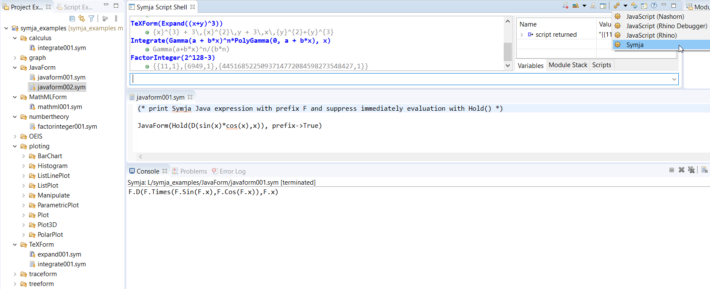

# Symja example GIT Repository
 
 
[Symja computer algebra language](https://github.com/axkr/symja_android_library) integration with [Eclipse EASE - scripting environment](https://www.eclipse.org/ease/) for the [Eclipse platform](https://www.eclipse.org/)
   
Here you can find a Symja example GIT Repository:

 
  